# MultiGroup Team Headquarter

# 🧠 Bu Repo Neden Var?

**MultiGroup** Team Headquarters, ekip üyelerinin sürece daha kolay ve hızlı bir şekilde adapte olabilmeleri için tasarlanmıştır. Burada planlanan etkinlikler, kaynak dokümanları, önceki çalışmalar ve genel bilgiler gibi çeşitli içerikler bulabilirsiniz. Eğer bir katılımcı olarak bu sayfaya eriştiyseniz, bizi daha iyi tanımanız adına bu repoyu incelemenizden memnuniyet duyarız. Hatırlatmak isteriz ki, bu repoda paylaşılan birçok kaynak ekip üyelerine özel hazırlanmıştır ve genellikle tıkladığınız linklerde erişim isteği sayfasıyla karşılaşabilirsiniz. Ancak derinlemesine incelerseniz, hakkımızda çok fazla detay öğrenme fırsatınız olabilir!

# 🌟 MultiGroup Pioneers Team Members

**MultiGroup**, yılın her dönemi kendini geliştirmek ve katıldığı etkinlikleri iyileştirmek isteyen katılımcılar için başvuru ve mülakat süreci sonucunda ekibine kapılarını açar. Bu süreçte, kendini geliştirmek isteyen adaylar, uygunluklarını değerlendirmek için Pioneer Programı'na katılırlar. Pioneer Programı, katılımcılara MultiGroup'un etkinliklerini düzenlerken nelere dikkat etmeleri gerektiğini, ekip halinde nasıl etkili bir şekilde çalışacaklarını ve bilmesi gereken diğer önemli kavramları öğretir. Bu program sayesinde katılımcılar, ekibe hızla adapte olur ve ekibin güçlü bir parçası haline gelirler. Eğer sen de bu heyecan verici sürece dahil olmak istiyorsan, başvurunu [bu linkten](https://forms.gle/eDaNGhWe98qLiiVM7) yapabilirsin.

## Pioneer A Ekibimiz ile Tanışın

<table>
  <tr>
    <td align="center">
      <a href="https://www.linkedin.com/in/enesfehmimanan/">
        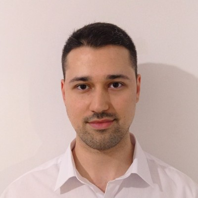
         
        <b>Enes Fehmi Manan</b>
      </a>
       
    </td>
    <td align="center">
      <a href="https://www.linkedin.com/in/zehratunckol/">
        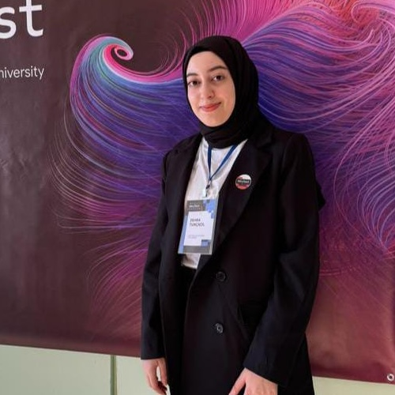
         
        <b>Zehra TUNÇKOL</b>
      </a>
       
    </td>
    <td align="center">
      <a href="https://www.linkedin.com/in/ozlembasabakar/">
        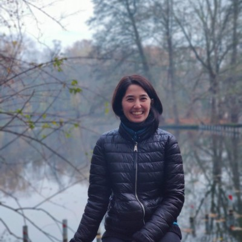
         
        <b>Özlem Başabakar</b>
      </a>
       
    </td>
  </tr>
  <tr>
    <td align="center">
      <a href="https://www.linkedin.com/in/furkanunsalan">
        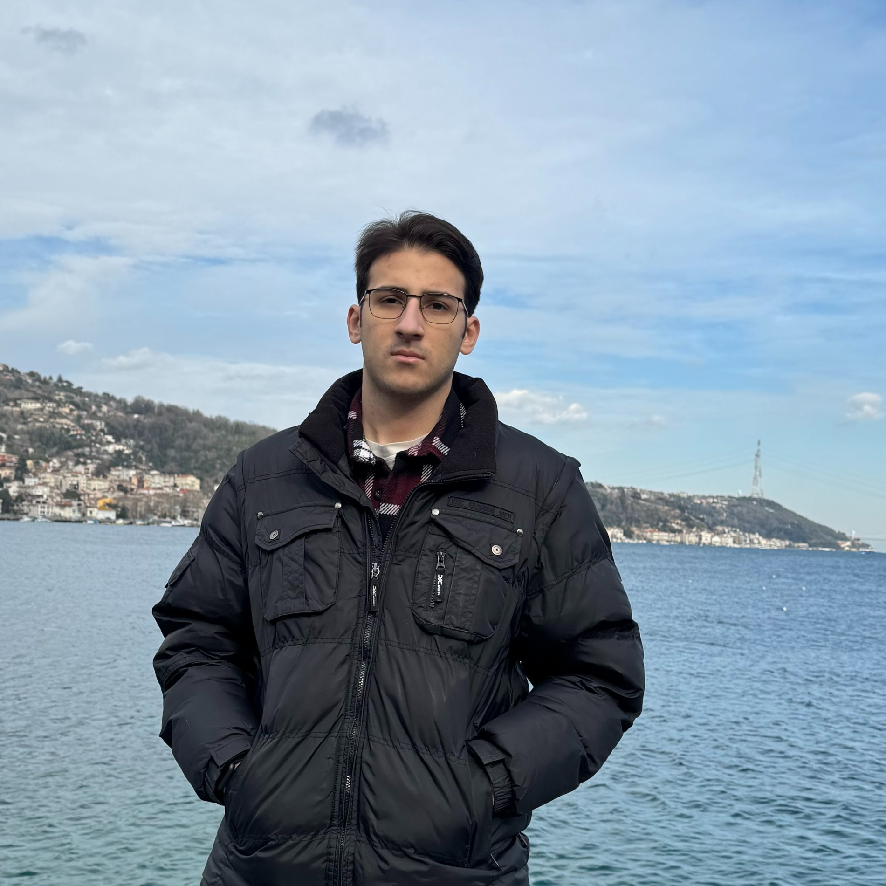
         
        <b>Furkan Ünsalan</b>
      </a>
       
    </td>
    <td align="center">
      <a href="https://www.linkedin.com/in/elif-%C3%A7a%C4%9F%C4%B1l/">
        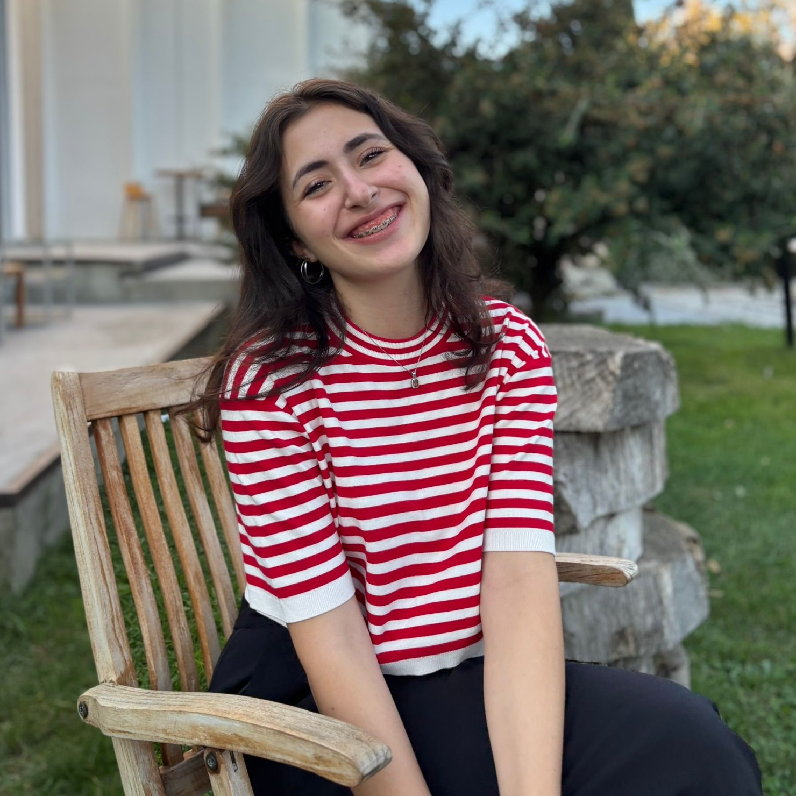
         
        <b>Elif Çağıl</b>
      </a>
       
    </td>
    <td align="center">
      <a href="https://www.linkedin.com/in/irem-aral-b6054517a/">
        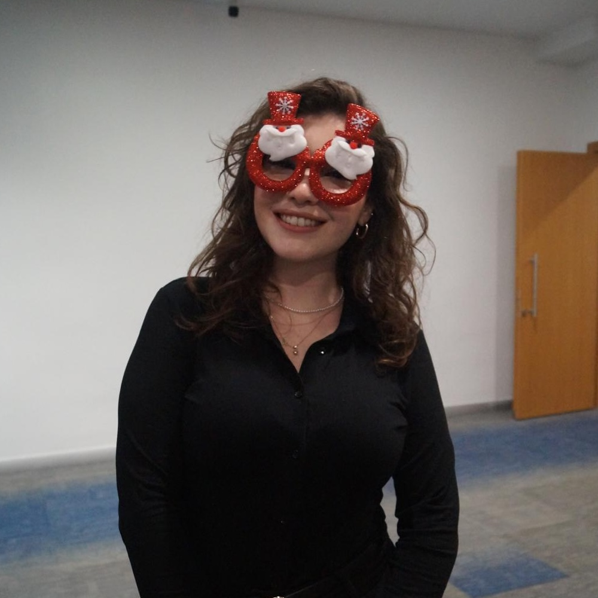
         
        <b>İrem Aral</b>
      </a>
       
    </td>
  </tr>
  <tr>
    <td align="center">
      <a href="https://www.linkedin.com/in/emirhan-akdemir-ea/">
        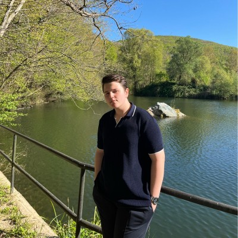
         
        <b>Emirhan Akdemir</b>
      </a>
       
    </td>
  </tr>
</table>

## Pioneer B Ekibimiz ile Tanışın

<table>
  <tr>
    <td align="center">
      <a href="https://www.linkedin.com/in/buket-akdemir-bukakd/">
        
         
        <b>Buket Akdemir</b>
      </a>
       
    </td>
    <td align="center">
      <a href="https://www.linkedin.com/in/esra-eken-5a8549135/">
        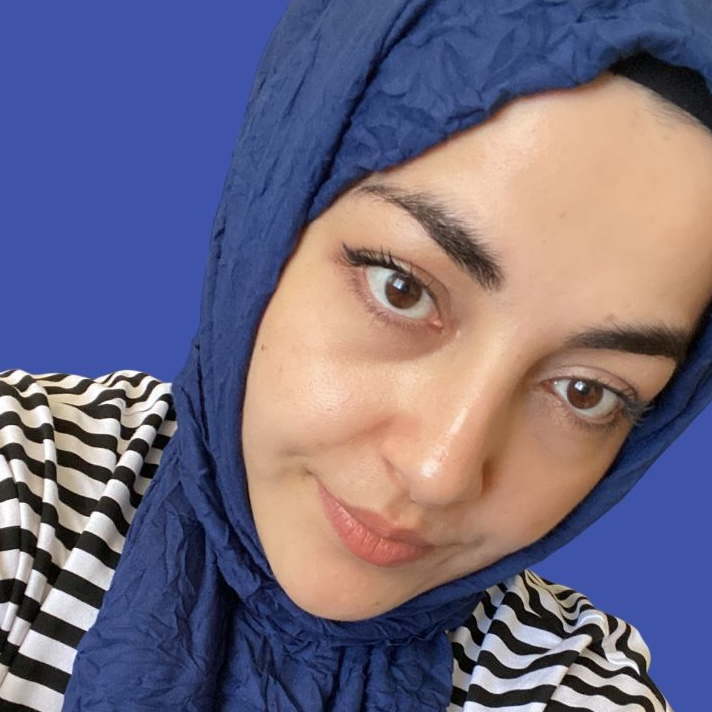
         
        <b>Esra Eken</b>
      </a>
       
    </td>
    <td align="center">
      <a href="https://www.linkedin.com/in/murat-mert-%C5%9Fenkaya-21a793246/">
        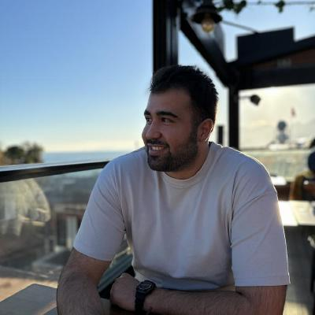
         
        <b>Murat Mert Şenkaya</b>
      </a>
       
    </td>
  </tr>  
  <tr>
    <td align="center">
      <a href="https://www.linkedin.com/in/aysunkuccuk/">
        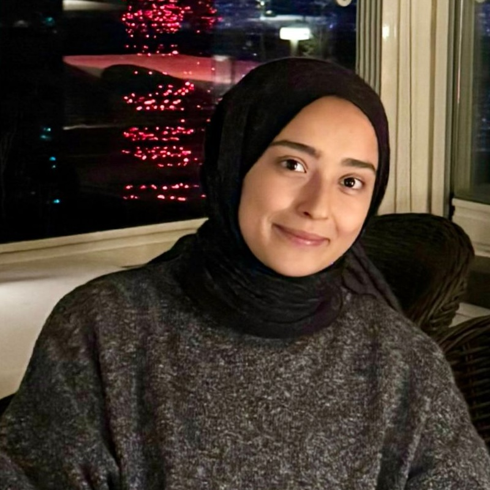
         
        <b>Aysun Küççük</b>
      </a>
       
    </td>
    <td align="center">
      <a href="https://www.linkedin.com/in/zeynep-dilara-koru-961a061b9/">
        
         
        <b>Zeynep Dilara Koru</b>
      </a>
       
    </td>
    <td align="center">
      <a href="https://www.linkedin.com/in/engin-can-yakar-17394225a/">
        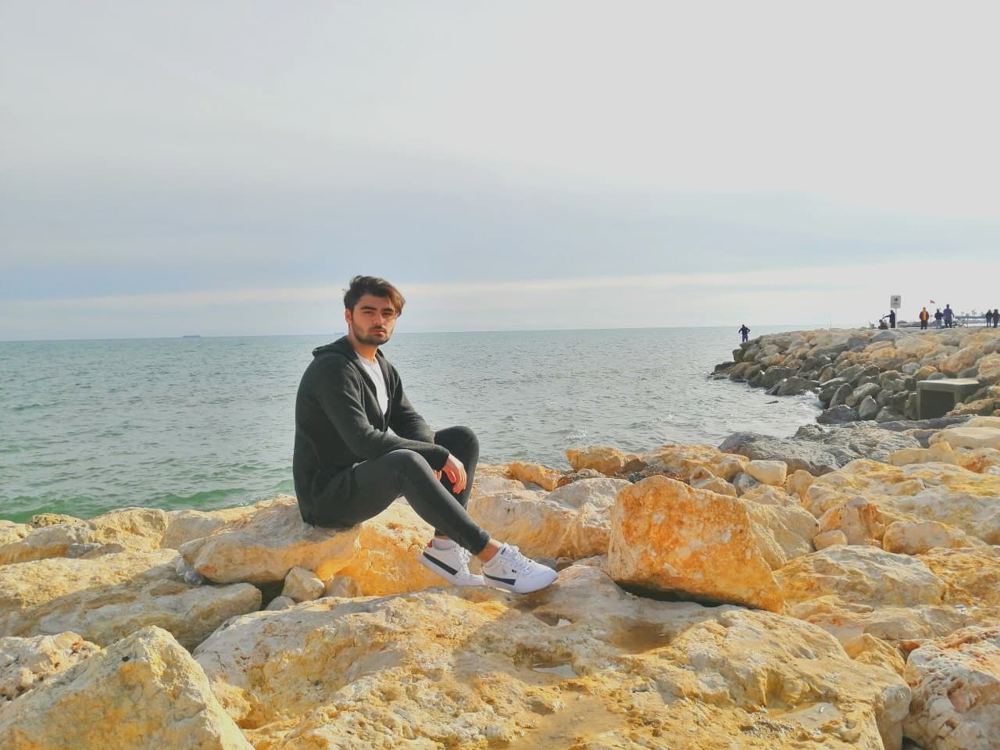
         
        <b>Engin Can Yakar</b>
      </a>
       
    </td>
  </tr>
  <tr>
    <td align="center">
      <a href="https://www.linkedin.com/in/furkan-t%C3%BCz%C3%BCn/">
        
         
        <b>Furkan Tüzün</b>
      </a>
       
    </td>
    <td align="center">
      <a href="https://www.linkedin.com/in/esra-kellecii/">
        
         
        <b>Esra Kelleci</b>
      </a>
       
    </td>
    <td align="center">
      <a href="https://www.linkedin.com/in/zehra-tahta-6117252a4/">
        
         
        <b>Zehra Tahta</b>
      </a>
       
    </td>
  </tr>
</table>

# 📌 Süreç İçi İncelenmesi Gereken Linkler

- [DMG Pioneers A Weekly Tasks](https://github.com/Developer-MultiGroup/MultiGroup.hq/wiki/Pioneer-A-Team-Tasks)
- [DMG Pioneers B Weekly Tasks](https://github.com/Developer-MultiGroup/MultiGroup.hq/wiki/Pioneer-B-Team-Tasks)
- [DMG Library | Work Documantation](https://github.com/Developer-MultiGroup/MultiGroup.hq/blob/main/documentation_library.md)
